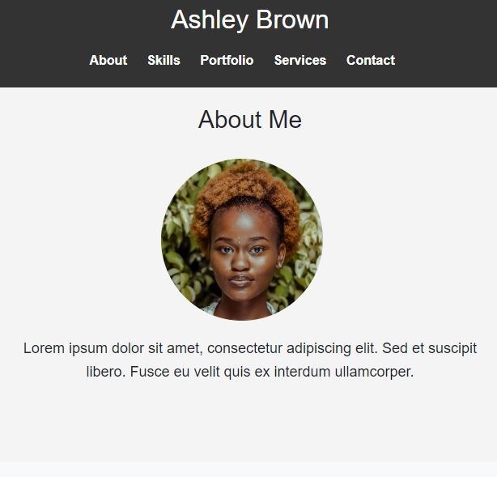

Photography Portfolio Template

Welcome to the Photography Portfolio Template! This template is designed to help photographers, artists, and creatives showcase their work in a stunning and professional manner. Whether you're a professional photographer or an aspiring artist, this template provides you with the tools you need to create an impressive online portfolio.

Features

Sleek Design: 
Impress your audience with a sleek and modern design that puts your photos in the spotlight.

Responsive Layout: 
Your portfolio will look flawless on any device, from desktops to smartphones.

Easy Navigation: 
Streamlined navigation ensures visitors can effortlessly explore your About, Skills, Portfolio, Services, and Contact sections.

Dynamic Portfolio Carousel: 
Showcase your best work with a dynamic portfolio carousel that elegantly displays your photos.

Service Offerings: 
Highlight your services and rates, making it easy for potential clients to understand what you offer.

Customization Ready: 
Ready to personalize? Our template allows for easy customization to reflect your unique style and branding.

Getting Started
Purchase the Template: 
Send an email to 9iva@gmail.com with a confirmation of your purchase from our website.

Provide Necessary Details: 
Include a new email address that will be associated with your website, along with a password for us to create a GitHub account and transfer the template files to you.

Customize Your Template: 
Once you've received the template, customize it to suit your brand. Need assistance? We offer customization services for a fee of $30.

Host Your Website: 
Choose your preferred hosting platform, such as Hostinger, Vercel, or Netlify, and register your domain.

Complete Customization: 
After setting up your hosting and domain, forward us an email containing all the necessary information for successful customization.

Support!

If you have any questions, issues, or need assistance with customization, feel free to contact us at 9iva@gmail.com. We're here to help you make the most out of your photography portfolio!